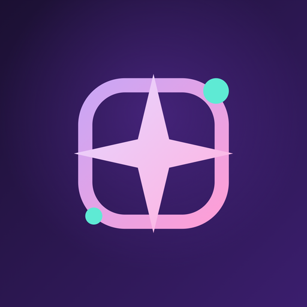

<p align="center">
  
</p>

<h1 align="center">PixelDream</h1>

<p align="center">
  Turn a short idea into a picture — right on your phone, no internet required.
</p>

<p align="center">
  <a href="https://chartmann1590.github.io/pixeldream/">Website</a> ·
  <a href="https://chartmann1590.github.io/pixeldream/privacy/">Privacy Policy</a> ·
  <a href="https://buymeacoffee.com/charleshartmann">☕ Support this project</a>
</p>

---

## What is PixelDream?

PixelDream is a private, offline image generator for Android. Type a short
idea — "a fox reading by a rainy window" — and PixelDream turns it into a
finished image without ever sending your words or your pictures anywhere.

Everything happens on your device: a small on-device AI first expands your
idea into a richer description, then a local image model paints it. Your
prompts and your pictures never leave your phone unless you choose to share
them.

## Why people like it

- 🔒 **Private by design.** Image generation runs entirely on your device.
  Nothing about what you type or create is uploaded.
- ✈️ **Works without Wi-Fi or data.** After a one-time setup download, you
  can generate images on a plane, off the grid, anywhere.
- 🎨 **Simple to use.** Describe what you're imagining, tap Create, and
  PixelDream fills in the rest — no prompt-engineering skills needed.
- 🖼️ **Your own private gallery.** Every image you make is saved locally so
  you can revisit, export, or share it whenever you like.
- 🎛️ **Control the details.** Choose image quality and size to balance
  speed against how detailed the result looks.

## Getting started

1. Install PixelDream from Google Play.
2. On first launch, download the two on-device models (about 4 GB combined
   — do this on Wi-Fi). This only happens once.
3. Describe what you're imagining and tap **Create image**.
4. Find every image you've made in **Gallery**, ready to view, export, or
   share.

## What you'll need

- An Android phone running Android 10 or newer
- 6 GB of RAM (8 GB or more recommended for the best experience)
- About 5 GB of free storage for the one-time model download

Older or lower-memory devices may run slowly or may not be supported.

## A note on generated content

PixelDream includes on-device checks that try to steer prompts and results
away from harmful content, but no filter is perfect. Please use PixelDream
responsibly, and use the in-app report option if you ever see something that
shouldn't have gotten through.

## Support the project

PixelDream is a solo, independently-built app. If you enjoy it, the nicest
way to say thanks is to leave it a rating on Google Play, or buy me a coffee:

**[buymeacoffee.com/charleshartmann](https://buymeacoffee.com/charleshartmann)**

## Questions or found a bug?

Use **Settings → Report a Problem** in the app, or open an issue on
[GitHub](https://github.com/chartmann1590/pixeldream/issues).

---

## For developers

The sections below are for people building or contributing to PixelDream,
not for everyday users.

### Under the hood

PixelDream uses two on-device AI models:

- **Gemma 4 (E2B)**, running through Google's LiteRT-LM runtime, expands a
  short idea into a richer visual prompt.
- **Stable Diffusion 1.5**, running through
  [`stable-diffusion.cpp`](https://github.com/leejet/stable-diffusion.cpp),
  renders the final image from that prompt.

Both run locally via JNI-wrapped native inference — no server round trip for
generation itself. Exact model URLs, revisions, sizes, and checksums are
documented in [`docs/models/README.md`](docs/models/README.md) and pinned in
`OfficialModelCatalog.kt`.

### Building from source

Prerequisites: JDK 17, Android SDK 35, Android NDK 27.0.12077973, and CMake
3.22.1. Clone recursively — the native diffusion runtime is a submodule.

```bash
git clone --recurse-submodules https://github.com/chartmann1590/pixeldream.git
cd pixeldream
./gradlew assembleDebug
```

Install on a connected ARM64 device:

```bash
./gradlew installDebug
```

### Project layout

| Module | Responsibility |
|---|---|
| `app` | Compose UI, navigation, generation workflow, gallery, and settings |
| `core-model` | Downloads, verification, Gemma and diffusion session lifecycle |
| `stablediffusion` | JNI wrapper and native ARM64 diffusion build |
| `core-data` | Room generation history |
| `core-ui` | Shared design system |
| `core-billing` | Optional ad-free entitlement |
| `cloudflare-worker` | Optional proxy: keeps the feedback-reporter GitHub token off-device |

### License notices

PixelDream bundles or downloads models and runtimes under their own license
and acceptable-use terms (Gemma, Stable Diffusion/OpenRAIL, LiteRT-LM,
stable-diffusion.cpp). See **Settings → Model and open-source licenses** in
the app, or [`docs/models/README.md`](docs/models/README.md).
